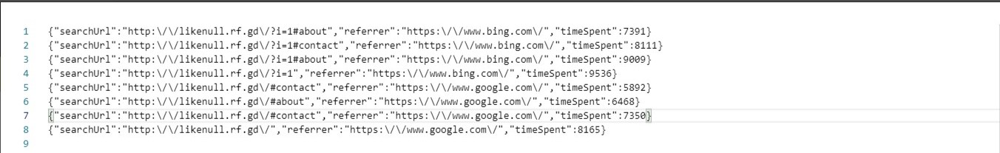

# Tracking User Navigation with popstate Event
 This code listens to the popstate event, which fires when the user navigates back or forward in their browser history. When this event is triggered, the code retrieves the URL of the current search results page, the referrer URL (Google, Bing, Yahoo)(the URL of the page that referred the user to the current page), and the time the user has spent on the website.

This information is then used to create a custom event called <b>userNavigatedBack</b> with the data as detail property. This custom event is then dispatched using the document.dispatchEvent() method.

Finally, an XMLHttpRequest is sent to the server with the custom event data as a JSON string. The server can then use this information for tracking user behavior, user experience improvements, or other analytics purposes.

# How to use
 To use this code, simply add it to your website's JavaScript codebase. The <b>'popstate'</b> event will automatically be tracked and the custom event data will be sent to the server when the user navigates back.

<b>Note</b>: This code assumes that the server is running a PHP script at /store-info.php to receive the data. And that php code can save the event data in a txt file. 
  

 
# PHP File
Php code is paid. 
